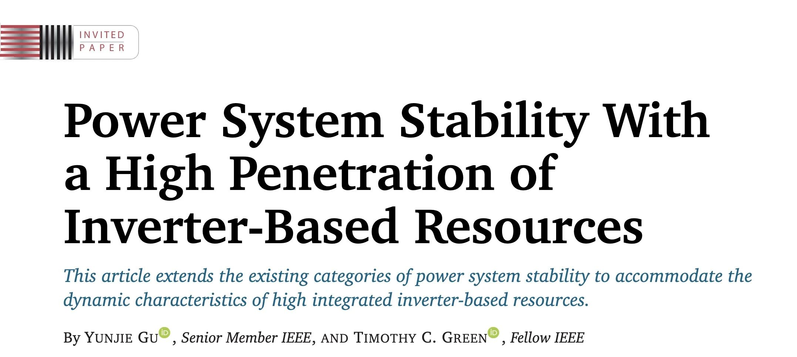
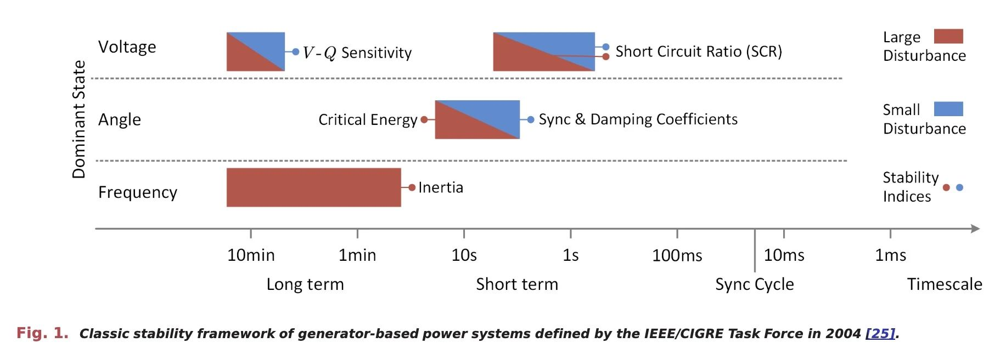
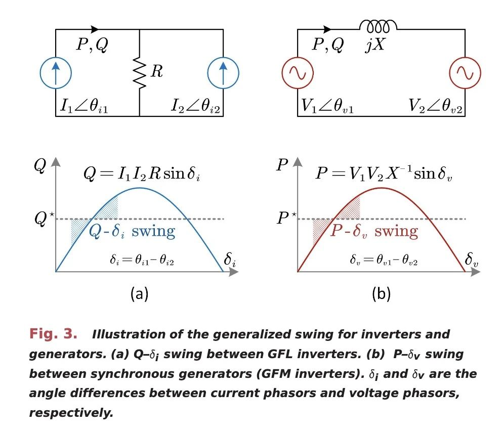
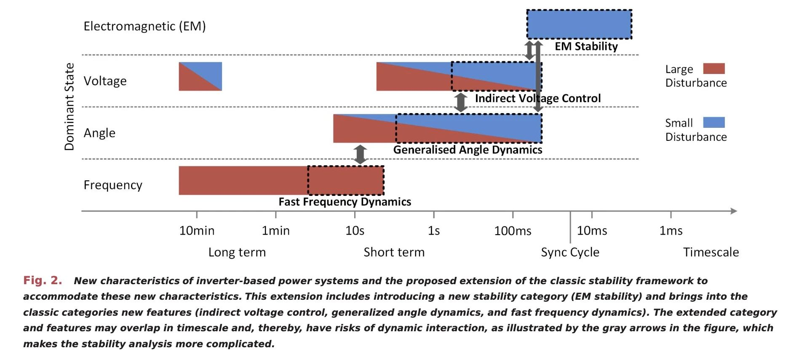

import imageLeslieAlexander from '@/images/team/leslie-alexander.jpg'

export const article = {
  date: '2024-3-22',
  title:
    'Power System Stability With a High Penetration of Inverter-Based Resources',
  description:
    'The review paper published in the IEEE Proceedings of the IEEE in 2023 comprehensively summarizes the opportunities and challenges brought by high penetration of inverter-based resources (IBRs) to power system stability. It explores new dynamic characteristics introduced by IBRs, their impact on traditional stability frameworks, and suggests future research directions to enhance stability analysis methods, metrics, and data-driven techniques.',
  author: {
    name: 'Professor Gu Yunjie',
    role: 'Co-Founder / CEO',
    image: { src: imageLeslieAlexander },
  },
}

export const metadata = {
  title: article.title,
  description: article.description,
}

## Introduction

With the rapid global development of renewable energy, inverter-based renewable energy sources (IBRs), such as wind and solar power, are increasingly penetrating power systems. These IBRs exhibit completely different dynamic characteristics compared to traditional synchronous generators, significantly altering the dynamic behavior of future power systems and presenting new challenges for stability.

## 1. Impact of IBRs on Traditional Power System Stability Framework

### 1.1 Stability Classification Dominated by Traditional Generators

Traditional power systems, dominated by synchronous generators, classify stability mainly by three dimensions: dominant state variables (rotor angle, frequency, voltage magnitude), time scales (long-term and short-term), and disturbance levels (small and large disturbances).

### 1.2 New Dynamic Characteristics Introduced by IBRs

IBRs exhibit significantly different dynamic characteristics:

- Electromagnetic transient stability
- Generalized angle dynamics
- Indirect voltage control
- Rapid frequency dynamics

These characteristics challenge traditional stability frameworks and require the introduction of new stability categories.

## 2. Technical Challenges and Future Research Directions

### 2.1 Challenges to Existing Stability Analysis Theories and Methods

- Difficulty in extending traditional methods to complex multi-inverter systems.
- Physical current saturation constraints adding complexity.
- Variability in control strategies among manufacturers.
- New complex dynamics from interactions between IBRs and other system components.

### 2.2 Future Research Directions

- Developing new stability analysis methods considering IBRs' complex control structures.
- Optimizing control loop response times to restore time-scale separation.
- Creating new stability metrics compatible with IBR characteristics.
- Leveraging operational big data for data-driven stability analysis.

## Conclusion

The increasing penetration of IBRs presents new dynamic characteristics that challenge traditional power system stability theories. To address this transformation, it is necessary to expand traditional stability classification frameworks, develop new stability analysis methods, and establish new stability evaluation metrics and auxiliary service specifications. Utilizing operational big data and data-driven techniques can support the safe and stable operation of future high-penetration renewable energy power systems. IBRs are and will continue to profoundly change power system planning, operation, and dispatch concepts, presenting both opportunities and challenges in the field of power system stability.
