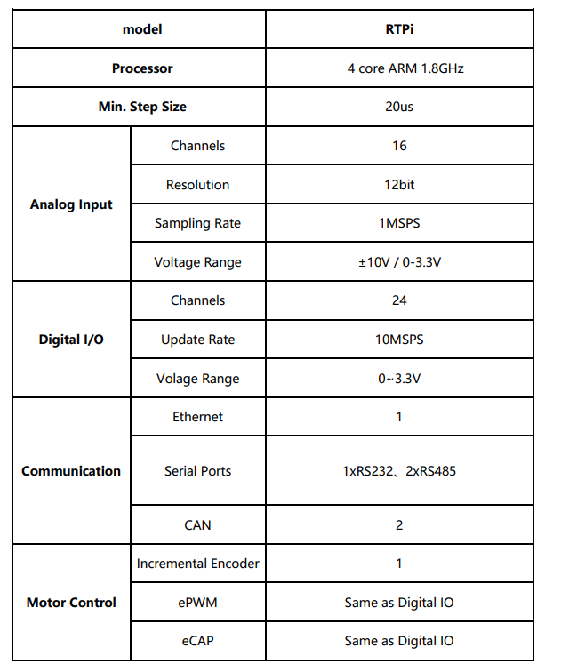

import logo from '@/images/clients/unseal/logomark-dark.svg'
import imageHero from './hero.jpg'
import imageEmilySelman from './emily-selman.jpg'
import RTPiBig from '@/images/RTPiBig.png'

export const caseStudy = {
  client: 'LEADRIVE',
  title: 'RTPi Real-Time Simulator',
  description: '',
  summary: [
    'The RTPi boasts a high-performance quad-core ARM CPU with a maximum clock speed of 1.8 GHz. It facilitates the rapid development of control algorithms and models using MATLAB Simulink, enabling seamless one-click downloads without the need for compilation.',
    'Leveraging world-leading numerical algorithms and bare-metal CPU technology, the RTPi delivers real-time simulations with step sizes as small as 20 μs and supports complex systems comprising up to 300 switching elements.',
  ],
  logo,
  image: { src: RTPiBig },
  date: '2020-02',
  service: 'Converter control DC/DC、DC/AC、OBC',
  testimonial: {
    author: { name: 'Emily Selman', role: 'Head of Engineering at LEADRIVE' },
    content:
      'After using RTPi real-time simulation products from InsRealm Technology Co., Ltd., we have witnessed significant performance improvements. Their team is very professional, solves problems quickly, and is a partner worth long-term cooperation with',
  },
}

export const metadata = {
  title: `RTPi Real-Time Simulator`,
  description:
    'The RTPi boasts a high-performance quad-core ARM CPU with a maximum clock speed of 1.8 GHz. It facilitates the rapid development of control algorithms and models using MATLAB Simulink, enabling seamless one-click downloads without the need for compilation.',
}

## Overview

The RTPi boasts a high-performance quad-core ARM CPU with a maximum clock speed of 1.8 GHz. It facilitates the rapid development of control algorithms and models using MATLAB Simulink, enabling seamless one-click downloads without the need for compilation. Leveraging world-leading numerical algorithms and bare-metal CPU technology, the RTPi delivers real-time simulations with step sizes as small as 20 μs and supports complex systems comprising up to 300 switching elements.

## Product Highlights

- **20μs**: Achieve ultra-high-frequency real-time simulation with a minimum step size of 20 microseconds through advanced numerical algorithms and bare-metal CPU technology.
- **Scalable Simulation**: Expand simulation scales conveniently through the distribution and parallelization of calculations.
- **Seamless, Realistic Simulation**: Supports real-time model insertion without disturbance to ensure realistic simulations.
- **Compact Dimensions**: 233x177x25mm, fulfilling customized application requirements with a small footprint.
- **One-click Download, Real-time Monitoring, Online Adjustment**: Integrated with MATLAB/Simulink, the product allows for one-click downloading, real-time monitoring, online parameter adjustments, and efficient debugging.

## Application Scenarios

1. **High-speed Motor Simulation**: Suitable for ultra-high-speed motor simulations, ensuring stable operation in systems with bandwidths exceeding 100kHz. The system can solve the problem of simulation at high frequency and offers solutions for a wide range of applications.
2. **Wind and Solar Power Storage Stations**: Simulate the complex interaction between wind, solar, and storage systems, ensuring comprehensive fault analysis, grid-connected analysis, and optimization of energy use.
3. **Hybrid Transmission Systems**: Applicable for hybrid transmission systems combining mechanical, electrical, and electronic components. The system offers robust simulation capabilities for mixed-signal environments.
4. **Electrified Transportation Systems**: For cars, ships, and aircraft, the simulator offers comprehensive system simulation, providing real-time test and verification for electrified and hybrid propulsion systems.

## Hardware Parameters

