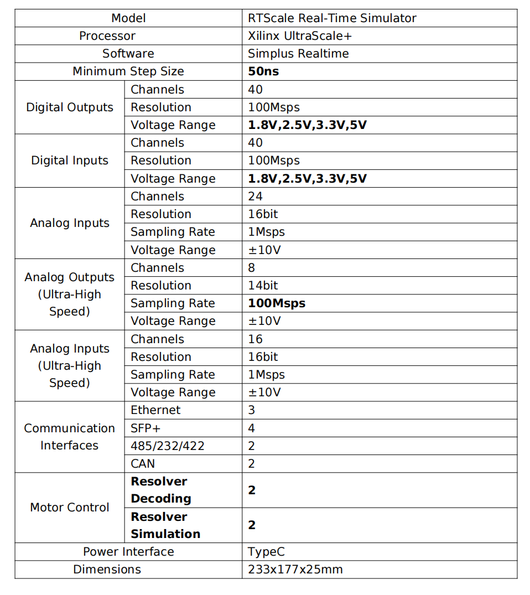

import logo from '@/images/clients/family-fund/logomark-dark.svg'
import imageHero from './hero.jpg'
import imageDebraFiscal from './debra-fiscal.jpg'
import RTScaleBig from '@/images/RTScaleBig.png'

export const caseStudy = {
  client: 'EASITECH',
  title: 'RTScale Real-Time Simulator',
  description: '',
  summary: [
    'RTScale is a high-performance, balanced product with an AMD Zynq UltraScale+ core. It introduces a world leading numerical computation method for complex, multi-loop models, achieving minimum simulation step size down to 50 ns.',
    "This device allows seamless switching between RCP and HIL modes, combining robust performance with extensive connectivity. It's portable and scalable, with straightforward operations that let engineers quickly set up secure, real-time virtual environments. It’s Ideal for efficient product development and compliance testing, meeting the needs of both corporate R&D and academic research.",
  ],
  logo,
  image: { src: RTScaleBig },
  date: '2020-01',
  service: 'High-speed motor simulation',
  testimonial: {
    author: { name: 'Debra Fiscal', role: 'CEO of EASITECH' },
    content:
      'The RTScale real-time simulation product makes our business operations more efficient. Their technical strength and service level have left a deep impression on us.',
  },
}

export const metadata = {
  title: `RTScale Real-Time Simulator`,
  description:
    'RTScale is a high-performance, balanced product with an AMD Zynq UltraScale+ core. It introduces a world leading numerical computation method for complex, multi-loop models, achieving minimum simulation step size down to 50 ns.',
}

## Overview

RTScale is a high-performance, balanced product with an AMD Zynq UltraScale+ core. It introduces a world leading numerical computation method for complex, multi-loop models, achieving minimum simulation step size down to 50 ns.

This device allows seamless switching between RCP and HIL modes, combining robust performance with extensive connectivity. It's portable and scalable, with straightforward operations that let engineers quickly set up secure, real-time virtual environments. It’s Ideal for efficient product development and compliance testing, meeting the needs of both corporate R&D and academic research.

## Product Highlights

- **Pioneering Numerical Methods**: World-leading numerical computation with FPGA simulation step size down to 50 ns and CPU simulation step size of 20 μs, supporting multi-core parallel simulation.

- **Comprehensive Connectivity**: Wide range of I/O interfaces, DAC conversion frequency up to 100 MHz, compact and portable design, supporting multi-machine parallel use.

- **Seamless MATLAB/Simulink Integration**: Full support for MATLAB/Simulink scripts and models, optimized real-time waveform adjustments.

- **HIL and RCP Mode Features**: Built-in high-performance FPGA simulation models, one-click deployment, supporting various control algorithms and motor types for broad application scenarios.

## Application Scenarios

1. **High-speed Motor Simulation**: Suitable for ultra-high-speed motor simulations, ensuring stable operation in systems with bandwidths exceeding 100kHz. The system can solve the problem of simulation at high frequency and offers solutions for a wide range of applications.
2. **Wind and Solar Power Storage Stations**: Simulate the complex interaction between wind, solar, and storage systems, ensuring comprehensive fault analysis, grid-connected analysis, and optimization of energy use.
3. **Hybrid Transmission Systems**: Applicable for hybrid transmission systems combining mechanical, electrical, and electronic components. The system offers robust simulation capabilities for mixed-signal environments.
4. **Electrified Transportation Systems**: For cars, ships, and aircraft, the simulator offers comprehensive system simulation, providing real-time test and verification for electrified and hybrid propulsion systems.

## Hardware Parameters

