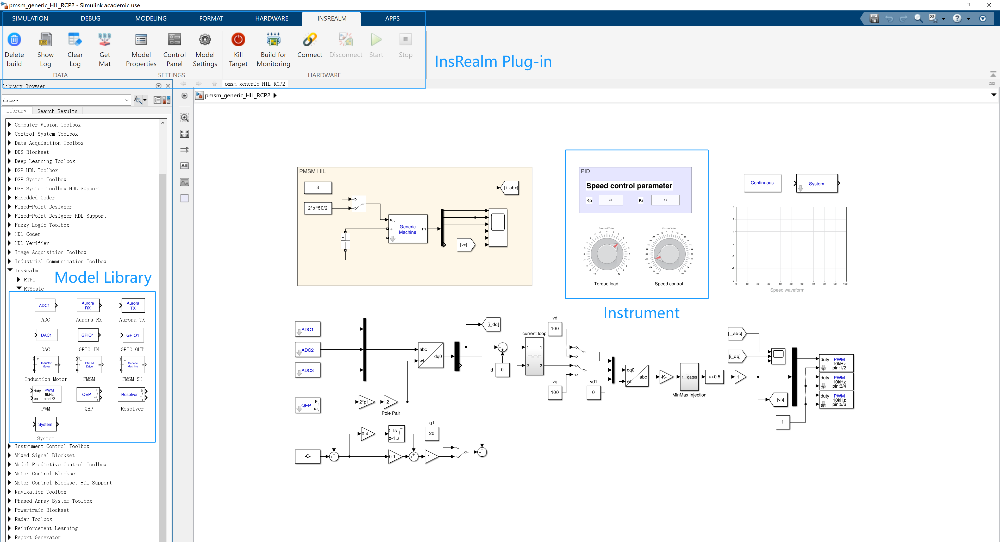
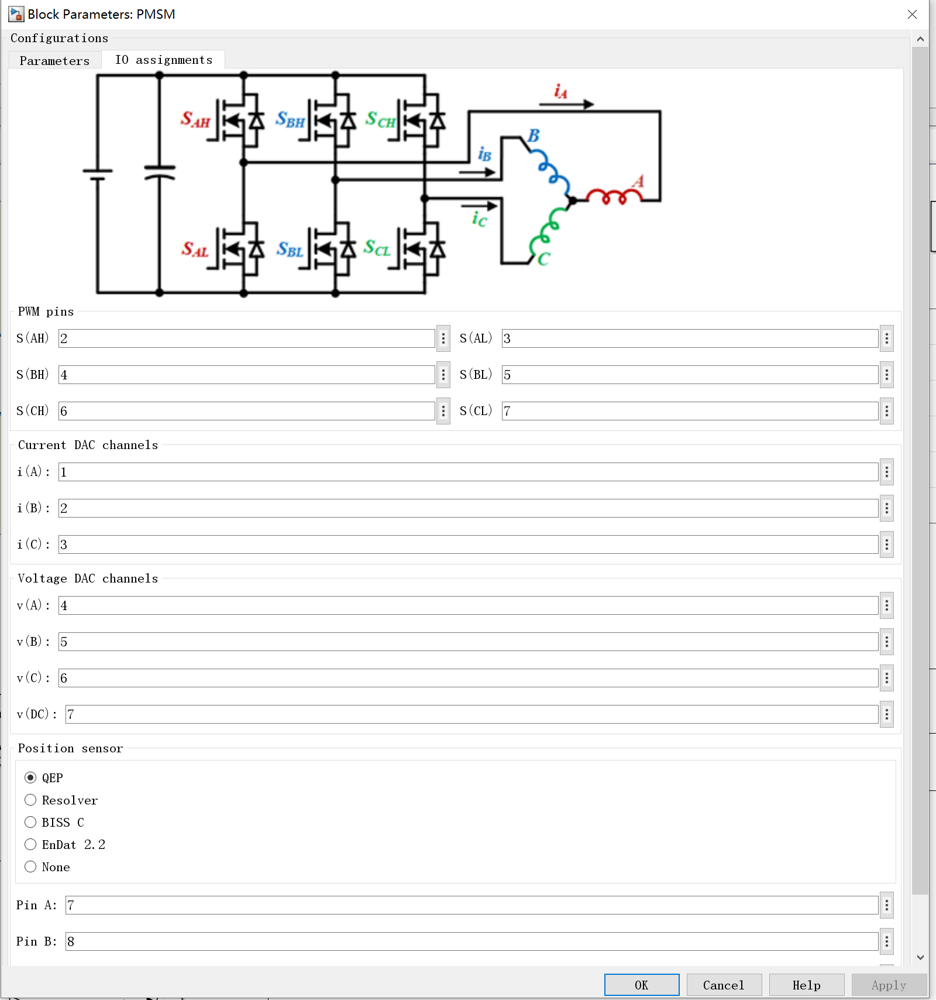
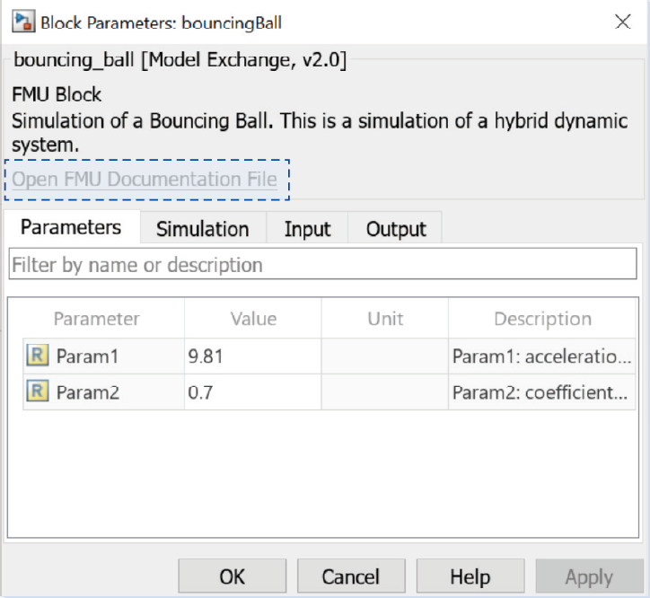
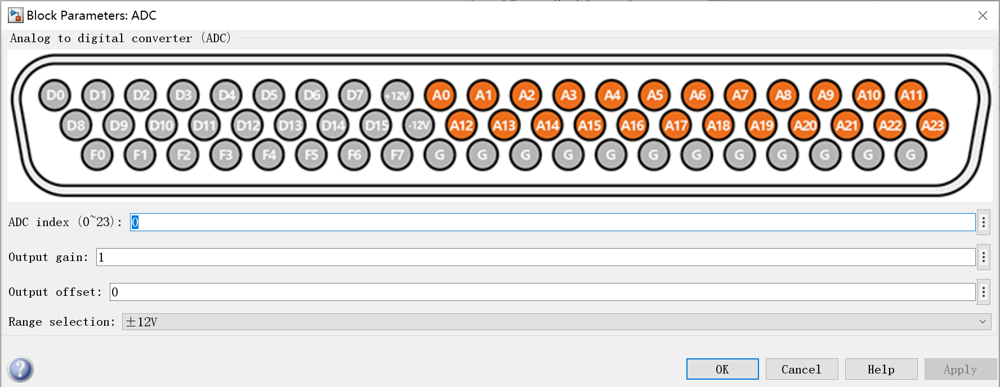
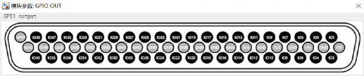
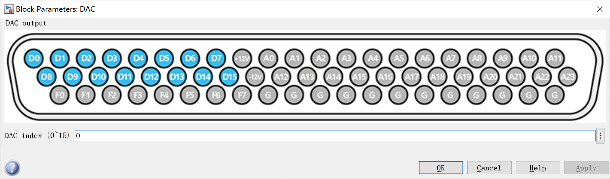
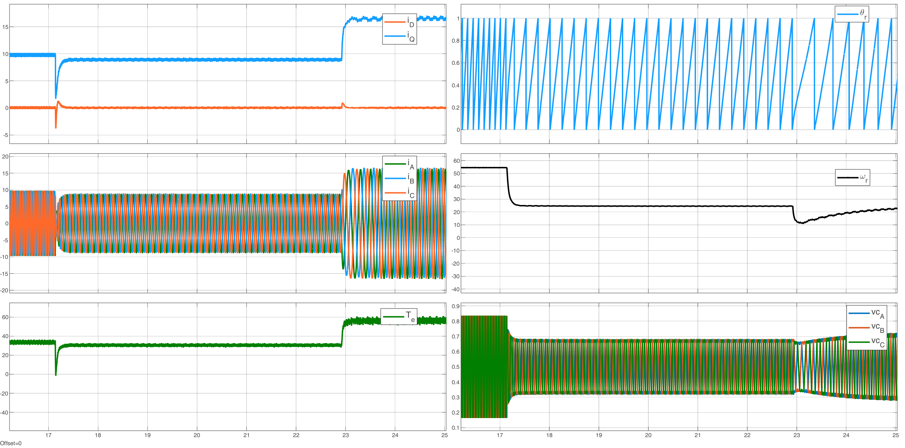
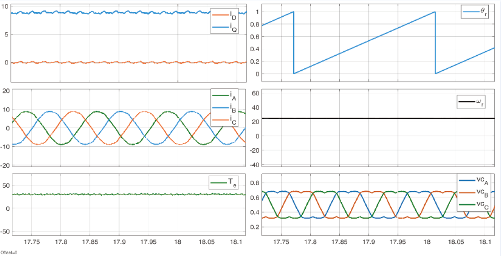

import logo from '@/images/clients/phobia/logomark-dark.svg'

export const caseStudy = {
  client: '',
  title: 'Insrealm',
  description: 'Real-time simulation software',
  summary: ['Real-time simulation software'],
  logo,
  image: { src: '' },
  date: '2020-06',
  service: 'App development',
  testimonial: {
    author: { name: 'Jenny Wilson', role: 'CPO of Phobia' },
    content:
      'The team at Studio went above and beyond with our onboarding, even finding a way to access the user’s microphone without triggering one of those annoying permission dialogs.',
  },
}

export const metadata = {
  title: `insrealm`,
  description: 'Real-time simulation software',
}

## Software display

- Installing 'InsRealm' allows seamless integration with Simulink, compatible with the physical and control models covered by Simulink Coder.

Modeling, toEditorSettings, and Debugging Interface

- Built-in high-performance motor simulation models with real circuit topologies for easy parameter adjustment. Compatible with QEP, Hall, Resolver sensors. Supports third-party black-box models via FMI interface, and motor models from Ansys (Maxwell), and Easimotor.

Motor Configuration Interface(1)

Motor Configuration Interface(2)

- Configuration interfaces for peripherals (DAC, ADC, GPIO) directly correspond to physical hardware, allowing easy pin configuration within the software. Optional adapter boards enable quick conversion between different interface types.

ADC Configuration Interfaces

DAC Configuration Interfaces

I/O Configuration Interfaces

- Optimized Simulink for real-time waveform display, ensuring smooth, lag-free perfor- mance with adaptive interface resizing, greatly enhancing the user experence.

Waveform Detection Interface (DQ Axis Current, Motor Three-Phase Current, Torque, Angle, Three-Phase Modulation Voltage)

Waveform Detection Interface (DQ Axis Current, Motor Three-Phase Current, Torque, Angle, Three-Phase Modulation Voltage)
